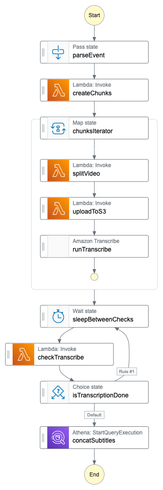

# Serverless "Get subtitles for a video" service

## About

This repo contains a **proof of concept** service which is able to generate subtitles for a video.



## Possible optimizations

- Instead of downloading the uploaded video from S3 to EFS, use _AWS DataSync_.

- One might try to add partitions to the _AWS Glue_ table that _AWS Athena_ uses to crawl the subtitle chunks.
  I was not able to make it work but you might be able to! Looking forward to hearing from you if you did.

## Deployment

1. Build the ffmpeg layer (needs to be done only once)

   ```shell
   npm run build-layer
   ```

2. Bootstrap

   ```shell
   npm run bootstrap
   ```

3. Deploy

   ```shell
   npm run deploy
   ```

4. Use the `apiUrl` output to get a presigned URL

   ```shell
   curl -X GET API_URL_ENDPOINT | jq
   ```

5. Use the returned presigned URL to upload an `.mp4` file you wish to generate subtitles for.

6. The subtitles for the video you have just uploaded will be available inside the S3 bucket (see the CloudFormation outputs) under `subtitles/STEP_FUNCTION_EXECUTION_NAME/result/STEP_FUNCTION_EXECUTION_NAME.csv`.

## Learnings

- I completely forgot that _"Lambda Functions in a public subnet can NOT access the internet"_
  This is because lambdas do not have public IP addresses - we do not have enough addresses for them!
  So, to enable the lambda to communicate with the outside world and vice-versa, _NAT Gateway_ (a.k.a the money printer for AWS) must be used.

- To transfer large files between S3 and Lambdas, one might use _DataSync_. _DataSync_ has the notion of a "destination" and a "source".
  There is a surprising amount of configurations you can specify. One note, though, **_Data Sync_ works in the context of VPC or an agent**.

- **The `Expires` property within the `PutObjectInput` is not the same as the `Expires` for the presigned-url**. The former is related to the cache TTL of a given object.

  - Why was my link not working whenever I've specified the `Expires` directly on the `PutObjectInput`? How was the signature different?
    - To explain, first, let us look at the `X-Amz-SignedHeaders`. If you specify the `Expires` property, it contains the `Expires` header.
      This means that the `Expires` header is used to calculate the request signature.
      Now it **would not be a problem if the `Expires` header was included in the generated presigned url. The problem is that the `PresignPutObject` ignores that header. It is not added to the url**.
      If you want to have a presigned url working with the `Expires` property specified, you will have to add it manually to the request.

- It seems like the `Content-Type` property while creating the presigned url is optional.
  The `Content-Type` will be inferred from the request headers, and if that is not possible (the `Content-Type` is missing there as well),
  S3 will try to infer the `Content-Type` on its own.

- The _Gateway Endpoints_ works on the IP level. The IP is routed to the endpoint, which then routes the request to a given service.

- The _mount path_ name of the EFS system for your Lambda functions [is constrained to a specific patter](https://docs.aws.amazon.com/AWSCloudFormation/latest/UserGuide/aws-properties-lambda-function-filesystemconfig.html).

- It takes significantly more time to deploy a Lambda in the context of the VPC than the non-VPC counterpart – all the architecture needed for it is provisioned at deploy time. Previously, all that would be done at invocation time. This is where the horrific Lambda cold-starts were coming from.

- **There is a correlation between the EFS Lambda mount path and the EFS AccessPoint root path. The EFS AccessPoint root path must be specified as the suffix to the _base_ Lambda mount path**.
  For example, let us say that our EFS AccessPoint root path is set to `/videos`. Then your Lambda mount path has to be specified as `/mnt/videos`.
  Otherwise, you will not be able to read from EFS within the Lambda.

- The _AWS SAR_ exists and contains various apps. Useful especially in the context of Lambda layers.
  You could use the ARN provided by the 3rd party, but you could also deploy the application (so the layer) within your account.
  This way, you have more control over versioning.

- The `--hotswap` is eventually consistent (expected nothing less tbh.). Worth remembering that Lambda service exposes two APIs
  for function updates – `UpdateFunctionCode` and `UpdateFunctionConfiguration`. On some occasions, CFN needs to call both of these APIs. This might result in a very short period when either your code or configuration is not in sync.
  [Here is a great resource to learn more](https://awsteele.com/blog/2020/12/24/aws-lambda-latest-is-dangerous.html).

- It would be super nice to upload things from EFS to S3 directly via StepFunctions SDK integrations, but I think I'm asking for a bit too much.

- Do not forget about the difference between _resource policies_ and the _identity-based policies_.
  [Here is the link to the docs](https://docs.aws.amazon.com/IAM/latest/UserGuide/access_policies_identity-vs-resource.html).

- The `startTranscribeJob` is an asynchronous task. Despite it being asynchronous, the permissions to carry out the whole flow (like uploading the result to the bucket) are checked at the invoke time. It seems to me like the _AWS Transcribe_ service uses the credentials that the request was made with to carry out all of its operations.

- Creating state loops with CDK is a bit weird. Since you cannot refer to the state that wraps the loops within the loop itself,
  it is created "implicitly". For example, I thought that by doing `task1.next(task2).next(choice("condition", task1).otherwise(endState))` I would need to specify the loop again with the `("condition", task1)` portion of the definition, but that is not the case.

- _AWS Athena_ is a nice service. With zero knowledge of how the service operates, I was able to query the subtitle chunks to concatenate them together. Sadly the CloudFormation support is lacking a tiny bit. It would be super nice to have a built-in resource for making queries.
  Having said that, though, the ability to create _AWS Glue_ tables through CFN and the integration with StepFunctions is excellent.

- I faced some issues with Athena query formatting. The Athena query I wanted to perform required the `like` condition. Contents of the `like` condition have to be wrapped with single quotes. This is a bit unfortunate as the body of the `States.Format` also has to be wrapped in single quotes.
  I was able to make it work by escaping the single quotes around the `like` condition with double slashes – `like \\'foo.bar\\'`

- > Athena supports CSV output files only. If you want to store query output files in a different format, use a CREATE TABLE AS SELECT (CTAS) query and configure the format property. After the query completes, drop the CTAS table.

  Meh, not great but not terrible. Ideally one would have the ability to change the output format. I see at least two solutions to this problem.

  - Use an [_S3 Object Lambda_](https://aws.amazon.com/s3/features/object-lambda/) to transform the file dynamically
  - Use _S3 trigger_ to do that after the Athena query finishes.

- Some of the _optimized_ `.sync` StepFunctions integrations are really pooling the result for you.
  A good example would be the Athena `StartQueryExecution` integration. The call is asynchronous in nature and returns an execution token.

- Scanning ALL of the subtitles chunks with _AWS Athena_ in search of ones with a particular `jobName` is suboptimal.
  While I could use partitions on the _AWS Glue_ side of things (while creating the table), the `startTranscriptionJob` would reject an S3 output with
  a path containing `=` symbol.
  To my best knowledge to use _AWS Glue_ table partitions, the S3 path [has to be formatted in a specific way](https://docs.aws.amazon.com/glue/latest/dg/aws-glue-programming-etl-partitions.html). Since I cannot use `=` symbol I'm not sure I can use that feature.
